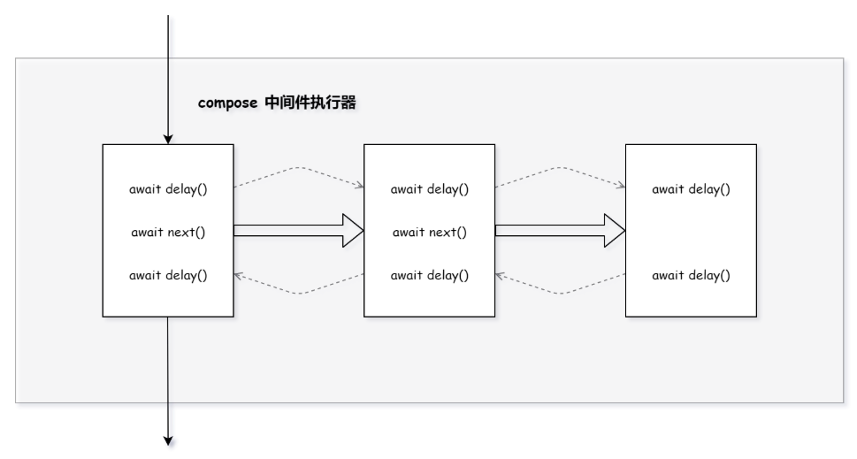

# [Koa源码学习] Koa

## 前言

`Koa`是一个基于`Nodejs`的`Web`框架，它没有内置任何中间件，而是提供了一套优雅的方法，来处理请求的执行流程，并且通过使用`async`、`await`语法，可以很方便的实现中间件的异步处理。

在每次收到来自客户端的请求时，`Koa`会创建一个上下文对象，代理原生的请求和响应，然后执行一系列的中间件函数，对请求进行相应的处理。那么接下来，我们就来看看`Koa`内部是如何实现的。

## 初始化阶段

在初始化阶段，我们可以将其分为以下三个步骤：

1. 初始化：初始化`Koa`实例
2. use：向实例中添加中间件
3. listen：创建服务器，开启监听

### 初始化

首先来看看`Koa`的构造函数，其代码如下所示：

```js
/* koa/lib/application.js */
const Emitter = require('events');
const context = require('./context');
const request = require('./request');
const response = require('./response');

// 继承Emitter，实现事件接口
module.exports = class Application extends Emitter {
  constructor(options) {
    // ...
    // 用来保存中间件列表
    this.middleware = [];
    // Koa实现的上下文对象，用来封装请求和响应
    this.context = Object.create(context);
    // 对原生请求对象的封装
    this.request = Object.create(request);
    // 对原生响应对象的封装
    this.response = Object.create(response);
    // ...
  }
}
```

可以看到，在创建`Koa`实例时，主要就是在当前实例上添加`middleware`、`context`、`request`和`response`实例属性。

### use

在创建`Koa`实例后，就可以使用`use`方法，向应用程序中添加中间件，其代码如下所示：

```js
/* koa/lib/application.js */
module.exports = class Application extends Emitter {
  use(fn) {
    if (typeof fn !== 'function') throw new TypeError('middleware must be a function!');
    // ...
    // 将中间件添加到middleware中
    this.middleware.push(fn);
    return this;
  }
}
```

可以看到，`use`方法就是接收一个函数，然后将其添加到`middleware`中。

### listen

添加完中间件后，就可以调用`listen`方法，开启服务器，其代码如下所示：

```js
/* koa/lib/application.js */
module.exports = class Application extends Emitter {
  listen(...args) {
    // 使用原生的http模块，创建服务器，开启监听
    const server = http.createServer(this.callback());
    return server.listen(...args);
  }
}
```

可以看到，`listen`就是使用原生的`http`模块，首先使用`http.createServer`方法创建一个服务器，然后立即调用`listen`方法，开启监听。这里最关键的就是通过调用`callback`方法，生成符合`request`事件的回调函数，其代码如下所示：

```js
/* koa/lib/application.js */
module.exports = class Application extends Emitter {
  callback() {
    // 处理中间件
    const fn = compose(this.middleware);

    // 添加应用层级的错误处理
    if (!this.listenerCount('error')) this.on('error', this.onerror);

    // 请求处理函数
    const handleRequest = (req, res) => {
      const ctx = this.createContext(req, res);
      return this.handleRequest(ctx, fn);
    };

    return handleRequest;
  }
}
```

可以看到，在`callback`方法中，首先使用`compose`方法，将`middleware`构建成一个执行器，然后定义`handleRequest`方法并返回，这个方法就是添加到`request`事件上的回调函数，在服务器开启后，每次收到来自客户端的请求时，都会执行该回调函数。那么接下来，就来看看`compose`是如何构建执行器的。

#### compose

`compose`方法是通过`koa-compose`模块提供的，代码如下所示：

```js
/* koa-compose/index.js */
function compose (middleware) {
  if (!Array.isArray(middleware)) throw new TypeError('Middleware stack must be an array!')
  for (const fn of middleware) {
    if (typeof fn !== 'function') throw new TypeError('Middleware must be composed of functions!')
  }

  // 中间件执行器，在处理请求时执行
  return function (context, next) {
    // last called middleware #
    let index = -1
    // 从第一个中间件开始执行，其返回结果是一个Promise
    return dispatch(0)
    function dispatch (i) {
      if (i <= index) return Promise.reject(new Error('next() called multiple times'))
      index = i
      let fn = middleware[i]
      // 执行下一个中间件执行器，koa-router中会用到
      if (i === middleware.length) fn = next
      if (!fn) return Promise.resolve()
      try {
        // 构造next参数，执行中间件
        // 使用Promise.resolve，确保中间件的异步执行
        return Promise.resolve(fn(context, dispatch.bind(null, i + 1)));
      } catch (err) {
        return Promise.reject(err)
      }
    }
  }
}
```

中间件在本质上看就是一组函数列表，而我们的目的，就是提供一个执行模型，在每次收到请求时，都从第一个中间件开始执行，在每次执行中间件之前，首先会构造一个`next`方法，它用来暂定当前正在执行的中间件，将控制权传递给下一个中间件，这样一来，所有的中间件都会按照**栈**模型，按照先入后出的顺序依次执行，同时，为了支持异步中间件，`Koa`使用`Promise.resolve`对中间件的执行结果进行包装，在上游的中间件中调用`await next()`时，必须等到下游中间件执行完毕后，才会执行`next`之后的代码，从而实现真正的异步中间件系统。



## 运行时阶段

经过上面的分析，我们已经开启了一个服务器，并且绑定了`request`事件，还将`middleware`构建成了一个异步执行器，之前注册的所有中间件，现在可以通过这个执行器，使其按照添加的顺序，依次执行。那么接下来，我们就来看看在`Koa`收到请求时，其内部是如何处理的，`request`事件的回调函数如下所示：

```js
/* koa/lib/application.js */
module.exports = class Application extends Emitter {
  callback() {
    // ...
    const handleRequest = (req, res) => {
      // 创建当前请求对应的上下文对象
      const ctx = this.createContext(req, res);
      // 执行中间件
      return this.handleRequest(ctx, fn);
    };
    // ...
  }
}
```

可以看到，在收到请求时，`Koa`会先使用`createContext`方法，创建本次请求对应的上下文对象，其代码如下所示：

```js
/* koa/lib/application.js */
module.exports = class Application extends Emitter {
  createContext(req, res) {
    // 创建context、request、response的实例
    const context = Object.create(this.context);
    const request = context.request = Object.create(this.request);
    const response = context.response = Object.create(this.response);
    context.app = request.app = response.app = this;
    // 建立与原生req、res之间的联系
    context.req = request.req = response.req = req;
    context.res = request.res = response.res = res;
    request.ctx = response.ctx = context;
    request.response = response;
    response.request = request;
    context.originalUrl = request.originalUrl = req.url;
    // Koa推荐存放自定义数据的命名空间
    context.state = {};
    return context;
  }
}
```

其实就是创建`context`、`request`、`response`的实例，然后建立与原生`req`和`res`之间的联系，这样做的好处就是可以通过`ctx`这个对象，访问所有与本次请求相关的资源，同时，`request`、`response`对象提供一系列常用的属性、方法，屏蔽了底层`http`模块的实现细节，方便使用。

在创建`ctx`后，就调用`handleRequest`方法，来执行中间件，其代码如下所示：

```js
/* koa/lib/application.js */
module.exports = class Application extends Emitter {
  handleRequest(ctx, fnMiddleware) {
    const res = ctx.res;
    // Koa默认的状态码
    res.statusCode = 404;
    // 处理本次请求相关的错误
    const onerror = err => ctx.onerror(err);
    // 处理最后的响应内容
    const handleResponse = () => respond(ctx);
    // 在res和res.socket上注册错误事件，确保在出错时，程序能正常执行
    onFinished(res, onerror);
    // 执行中间件的执行器
    return fnMiddleware(ctx).then(handleResponse).catch(onerror);
  }
}
```

可以看到，在`handleRequest`方法中，主要就是定义`onerror`和`handleResponse`，然后将上下文对象传入执行器，开始执行已添加的中间件。由于执行器的返回结果也是一个`Promise`，所以在其`fulfilled`时会调用`handleResponse`方法，处理响应逻辑，在其`rejected`时会调用`onerror`方法，进行错误处理。

### ctx.body

在中间件中，我们可以通过给`ctx.body`赋值，`Koa`会自动根据数据的类型，进行正确的处理。那么接下来，就来看看`Koa`内部是如何实现该过程的，其代码如下所示：

```js
/* koa/lib/response.js */
module.exports = {
  set body(val) {
    const original = this._body;
    // 将数据保存在_body中
    this._body = val;

    // 不携带响应体
    if (null == val) {
      if (!statuses.empty[this.status]) this.status = 204;
      if (val === null) this._explicitNullBody = true;
      this.remove('Content-Type');
      this.remove('Content-Length');
      this.remove('Transfer-Encoding');
      return;
    }

    // 覆盖默认的404
    if (!this._explicitStatus) this.status = 200;

    // set the content-type only if not yet set
    const setType = !this.has('Content-Type');

    // string
    if ('string' === typeof val) {
      if (setType) this.type = /^\s*</.test(val) ? 'html' : 'text';
      this.length = Buffer.byteLength(val);
      return;
    }

    // buffer
    if (Buffer.isBuffer(val)) {
      if (setType) this.type = 'bin';
      this.length = val.length;
      return;
    }

    // stream
    if (val instanceof Stream) {
      onFinish(this.res, destroy.bind(null, val));
      if (original != val) {
        val.once('error', err => this.ctx.onerror(err));
        // overwriting
        if (null != original) this.remove('Content-Length');
      }

      if (setType) this.type = 'bin';
      return;
    }

    // json
    this.remove('Content-Length');
    this.type = 'json';
  }
}
```

可以看到，在给`body`赋值时，首先将数据赋值给`_body`，然后进行如下判断：

1. 如果值为`null`：说明响应体为空，首先通过`statuses.empty`，判断当前状态码是否是`204,205,304`，如果不是，就设置成默认的`204`，然后移除`Content-Type`、`Content-Length`、`Transfer-Encoding`响应头。

2. 如果值的类型是`String`：在没有设置过`Content-Type`的情况下，如果内容的第一个非空白字符是`<`，就将`Content-Type`设置成`text/html`，否则，设置成`text/plain`，然后将`Content-Length`设置成`Buffer.byteLength`。

3. 如果值的类型是`Buffer`：在没有设置过`Content-Type`的情况下，将其设置成`application/octet-stream`，将`Content-Length`设置成`buffer.length`。

4. 如果值的类型是`Stream`：就使用`onFinish`方法，确保在响应流关闭或发生错误时，可以对资源进行清理工作，最后，同样在没有设置过`Content-Type`时，将其设置成`application/octet-stream`。

5. 如果以上的条件都不满足，`Koa`就将内容当作`JSON`处理，设置`Content-Type`为`application/json`。

以上的逻辑，主要是用来设置`Content-Type`和`Content-Length`，但是此时并没有返回具体的响应内容，只是将数据临时存放在`res._body`中，当所有的中间件执行完毕，或没有继续调用`next`执行下一个中间件时，本次执行器就执行完毕了，此时就会调用之前的`handleResponse`方法，在此方法中，`Koa`会继续调用`respond`方法，这里才是返回响应的地方，其代码如下所示：

```js
/* koa/lib/application.js */
function respond(ctx) {
  // 绕过Koa的内置response处理，需要自己处理res
  if (false === ctx.respond) return;

  if (!ctx.writable) return;

  const res = ctx.res;
  let body = ctx.body;
  const code = ctx.status;

  // 状态码为204,205,304，不需要响应体，直接结束响应
  if (statuses.empty[code]) {
    // strip headers
    ctx.body = null;
    return res.end();
  }

  // HEAD请求不需要响应体，直接结束响应
  if ('HEAD' === ctx.method) {
    if (!res.headersSent && !ctx.response.has('Content-Length')) {
      const { length } = ctx.response;
      if (Number.isInteger(length)) ctx.length = length;
    }
    return res.end();
  }

  // 状态码不是204,205,304，并且响应内容为null，将原因短语作为响应体返回
  if (null == body) {
    if (ctx.response._explicitNullBody) {
      ctx.response.remove('Content-Type');
      ctx.response.remove('Transfer-Encoding');
      return res.end();
    }
    if (ctx.req.httpVersionMajor >= 2) {
      body = String(code);
    } else {
      body = ctx.message || String(code);
    }
    if (!res.headersSent) {
      ctx.type = 'text';
      ctx.length = Buffer.byteLength(body);
    }
    return res.end(body);
  }

  // 根据数据的类型，返回对应的响应内容
  if (Buffer.isBuffer(body)) return res.end(body);
  if ('string' === typeof body) return res.end(body);
  if (body instanceof Stream) return body.pipe(res);

  // body: json
  body = JSON.stringify(body);
  if (!res.headersSent) {
    ctx.length = Buffer.byteLength(body);
  }
  res.end(body);
}
```

可以看到，`respond`方法的判断逻辑和设置`body`时是很类似的，`Koa`会根据数据的类型，调用原生的`end`或`pipe`方法，返回对应的响应内容，默认情况下，`Koa`会使用`JSON.stringify`，将数据转换成`JSON`格式返回。

## 总结

`Koa`的整体逻辑是很简单的，它只是提供一个框架，使用时，首先向`Koa`实例中添加中间件，然后在收到请求时，`Koa`会按照顺序，对它们依次进行执行，除此之外，`Koa`内部提供了大量的属性、方法，用来封装底层`http`的实现细节，在中间件中，可以通过直接给`body`赋值，来对请求进行响应。
