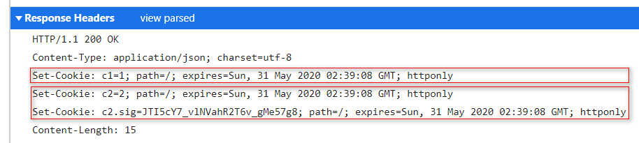

# [Koa源码学习] koa cookie

## 前言

`HTTP`是一种无状态的协议，浏览器通过引入`Cookie`技术，从而实现了保持状态的功能。当服务器收到`HTTP`请求时，服务器可以使用`Set-Cookie`响应头，向浏览器中设置`cookie`，在这之后，当浏览器再次对该服务器发起请求时，就会将`cookie`放到`Cookie`请求头中，然后连同其他信息一起发送给服务器。

`Koa`内部使用`cookies`模块，提供对`cookie`的支持，那么接下来，我们就来看看其内部是如何实现的。

## keys & ctx.cookies

在创建`Koa`实例时，可以通过`keys`选项，设置对`Cookie`签名的密钥，它是一个数组的形式，默认总是使用第一个密钥对`cookie`进行签名，但是也可以在运行过程中调整密钥的顺序，其代码如下所示：

```js
/* koa/lib/application.js */
module.exports = class Application extends Emitter {
  constructor(options) {
    // ...
    // 对Cookie签名的密钥列表
    if (options.keys) this.keys = options.keys;
    // ...
  }
};
```

收到请求时，在中间件中可以使用`ctx.cookies`设置和获取`cookie`，代码如下所示：

```js
/* koa/lib/context.js */
const Cookies = require('cookies');
const COOKIES = Symbol('context#cookies');

const proto = module.exports = {
  get cookies() {
    if (!this[COOKIES]) {
      // 创建Cookies实例
      this[COOKIES] = new Cookies(this.req, this.res, {
        keys: this.app.keys,
        // https
        secure: this.request.secure
      });
    }
    return this[COOKIES];
  },

  set cookies(_cookies) {
    this[COOKIES] = _cookies;
  }
};
```

可以看到，在同一个请求上下文中，首次访问`ctx.cookies`时，会创建一个`Cookies`的实例，这里会将当前请求的`req`、`res`，连同之前配置的密钥`keys`传入，之后就可以通过这个实例对`cookie`进行设置和获取了。

## Cookies

我们首先来看看`Cookies`的构造函数，其代码如下所示：

```js
/* cookies/index.js */
function Cookies(request, response, options) {
  if (!(this instanceof Cookies)) return new Cookies(request, response, options)

  this.secure = undefined
  this.request = request
  this.response = response

  if (options) {
    // ...
    // 使用Keygrip模块，进行签名和认证
    this.keys = Array.isArray(options.keys) ? new Keygrip(options.keys) : options.keys
    this.secure = options.secure
  }
}

Cookies.prototype.get = function(name, opts) {
  // ...
};

Cookies.prototype.set = function(name, value, opts) {
  // ...
};
```

可以看到，在实例化`Cookies`时，除了在当前实例上保存`request`和`response`外，还创建了`Keygrip`的实例，它是用来对`cookie`进行签名和认证的，我们首先来看看它是如何使用的。

### Keygrip

`Keygrip`的构造函数如下所示：

```js
/* keygrip/index.js */
function Keygrip(keys, algorithm, encoding) {
  // 默认哈希算法sha1，默认编码方式base64
  if (!algorithm) algorithm = "sha1";
  if (!encoding) encoding = "base64";
  if (!(this instanceof Keygrip)) return new Keygrip(keys, algorithm, encoding)

  // ...

  // 根据密钥对数据进行签名
  function sign(data, key) {
    return crypto
      .createHmac(algorithm, key)
      .update(data).digest(encoding)
      .replace(/\/|\+|=/g, function(x) {
        return ({ "/": "_", "+": "-", "=": "" })[x]
      })
  }

  this.sign = function(data){ return sign(data, keys[0]) }

  this.verify = function(data, digest) {
    return this.index(data, digest) > -1
  }

  this.index = function(data, digest) {
    for (var i = 0, l = keys.length; i < l; i++) {
      if (compare(digest, sign(data, keys[i]))) {
        return i
      }
    }

    return -1
  }
}
```

可以看到，在`Keygrip`构造函数中，这里的关键方法是`sign`，它使用原生的`crypto`模块，使用`sha1`哈希算法和密钥`key`，对数据`data`进行`hmac`，生成消息摘要，然后将其编码成`base64url`的格式并返回，除此之外，`Keygrip`的实例还提供三个实例方法：

* `sign`：对上面`sign`方法的包装，使用`keys`中第一个密钥对数据进行签名。

* `verify`：首先对数据进行签名，然后对比传入的签名`digest`，如果两者相等，说明校验通过。

* `index`：因为`keys`是一个密钥列表，在程序运行过程中，密钥的顺序可能会调整，`index`方法可以找到`digest`对应的密钥索引。

`Keygrip`模块就是给`cookie`提供了一套签名和验证的机制，那么接下来，我们就来看看如何设置和获取`cookie`的。

### set

我们首先来看看是如何通过`ctx.cookies`设置`cookie`的，其代码如下所示：

```js
/* cookies/index.js */
Cookies.prototype.set = function(name, value, opts) {
  var res = this.response
    , req = this.request
    // 获取缓冲中的Set-Cookie响应头
    , headers = res.getHeader("Set-Cookie") || []
    , secure = this.secure !== undefined ? !!this.secure : req.protocol === 'https' || req.connection.encrypted
    // 创建Cookie实例
    , cookie = new Cookie(name, value, opts)
    // cookie是否需要签名
    , signed = opts && opts.signed !== undefined ? opts.signed : !!this.keys

  if (typeof headers == "string") headers = [headers]

  // ...
  cookie.secure = opts && opts.secure !== undefined
    ? opts.secure
    : secure
  // ...

  // 将cookie添加到headers数组中
  pushCookie(headers, cookie)

  // 如果cookie需要签名，创建一条新的cookie，添加到headers数组中
  if (opts && signed) {
    if (!this.keys) throw new Error('.keys required for signed cookies');
    // name=value的消息摘要，cookie.name携带.sig后缀
    cookie.value = this.keys.sign(cookie.toString())
    cookie.name += ".sig"
    pushCookie(headers, cookie)
  }

  var setHeader = res.set ? http.OutgoingMessage.prototype.setHeader : res.setHeader
  // 设置Set-Cookie响应头
  setHeader.call(res, 'Set-Cookie', headers)
  return this
};
```

可以看到，在`cookies.set`方法中，首先会创建一条新的`Cookie`实例，其代码如下所示：

```js
/* cookies/index.js */
function Cookie(name, value, attrs) {
  // ...

  this.name = name
  this.value = value || ""

  for (var name in attrs) {
    this[name] = attrs[name]
  }

  // 设置expires，让浏览器删除对应的cookie
  if (!this.value) {
    this.expires = new Date(0)
    this.maxAge = null
  }

  // ...
}

// 原型上的默认属性，会被传入的attrs覆盖
Cookie.prototype.path = "/";
Cookie.prototype.expires = undefined;
Cookie.prototype.domain = undefined;
Cookie.prototype.httpOnly = true;
Cookie.prototype.sameSite = false;
Cookie.prototype.secure = false;
Cookie.prototype.overwrite = false;
```

可以看到，对于每一个`Cookie`实例，里面包含着所有与`cookie`相关的配置，通过这些配置信息，可以控制`cookie`在浏览器中的行为。

回到上面的`cookies.set`方法中，接着就会调用`pushCookie`，将`cookie`添加到`headers`数组中，其代码如下所示：

```js
/* cookies/index.js */
function pushCookie(headers, cookie) {
  // overwrite选项用来覆盖同名cookie
  if (cookie.overwrite) {
    for (var i = headers.length - 1; i >= 0; i--) {
      if (headers[i].indexOf(cookie.name + '=') === 0) {
        headers.splice(i, 1)
      }
    }
  }

  headers.push(cookie.toHeader())
}

Cookie.prototype.toString = function() {
  return this.name + "=" + this.value
};

Cookie.prototype.toHeader = function() {
  // 生成name=value
  var header = this.toString()

  // 根据配置选项，生成cookie相关的配置，控制cookie的行为
  if (this.maxAge) this.expires = new Date(Date.now() + this.maxAge);

  if (this.path     ) header += "; path=" + this.path
  if (this.expires  ) header += "; expires=" + this.expires.toUTCString()
  if (this.domain   ) header += "; domain=" + this.domain
  if (this.sameSite ) header += "; samesite=" + (this.sameSite === true ? 'strict' : this.sameSite.toLowerCase())
  if (this.secure   ) header += "; secure"
  if (this.httpOnly ) header += "; httponly"

  return header
};
```

可以看到，`pushCookie`方法就是根据`cookie`的配置，生成对应的字符串，然后将其添加到`headers`数组中。

回到上面的`cookies.set`方法中，如果检测到本条`cookie`需要签名，就使用`keys.sign`方法，对`name=value`进行消息摘要，然后继续使用`pushCookie`方法，创建一条新的`cookie`，其`cookie`名称为原始名称后面加上`.sig`，然后同样将签名后的`cookie`添加到`headers`中，所以对于需要签名的`cookie`来说，服务器会为其创建两条`cookie`，一条对应原始的，一条对应签名的。

在`cookies.set`的最后，通过`setHeader`方法，将所有的`cookie`设置到`Set-Cookie`响应头中，此时，设置`cookie`的工作就完成了。



### get

在收到请求时，可以通过`cookies.get`方法，从请求头中获取`cookie`，其代码如下所示：

```js
/* cookies/index.js */
Cookies.prototype.get = function(name, opts) {
  var sigName = name + ".sig"
    , header, match, value, remote, data, index
    , signed = opts && opts.signed !== undefined ? opts.signed : !!this.keys

  // cookie请求头
  header = this.request.headers["cookie"]
  if (!header) return

  // 根据name取出对应的cookie
  match = header.match(getPattern(name))
  if (!match) return

  // 如果不需要校验，则直接返回cookie的值
  value = match[1]
  if (!opts || !signed) return value

  // 如果需要校验，就再次调用get方法，通过[name].sig，获取消息摘要
  remote = this.get(sigName)
  if (!remote) return

  // 使用keys.index方法，对cookie进行校验，返回在密钥列表中的索引
  data = name + "=" + value
  if (!this.keys) throw new Error('.keys required for signed cookies');
  index = this.keys.index(data, remote)

  if (index < 0) {
    // cookie可能被篡改，删除[name].sig
    this.set(sigName, null, {path: "/", signed: false })
  } else {
    // index>0，则说明密钥的顺序做过修改，重新使用第一个密钥进行签名，最后返回cookie的值
    index && this.set(sigName, this.keys.sign(data), { signed: false })
    return value
  }
};
```

可以看到，在`cookies.get`方法中，首先从请求头中获取`cookie`，然后根据`name`找到对应的值`value`，如果不需要校验，则直接返回`value`即可；如果需要校验，就需要再次调用`get`方法，通过`[name].sig`，从`cookie`中获取上一次的消息摘要，然后使用`keys.index`方法，对`cookie`进行校验，如果校验通过，则说明此`cookie`没有被篡改，那么就返回`value`，如果校验失败，说明此`cookie`无效，无需返回。

## 总结

`Koa`通过`cookies`模块，提供对`cookie`的支持，在中间件中可以通过`ctx.cookies`接口，设置和获取`cookie`，同时在其内部使用`Keygrip`模块，提供对`cookie`进行签名和验证的机制。
