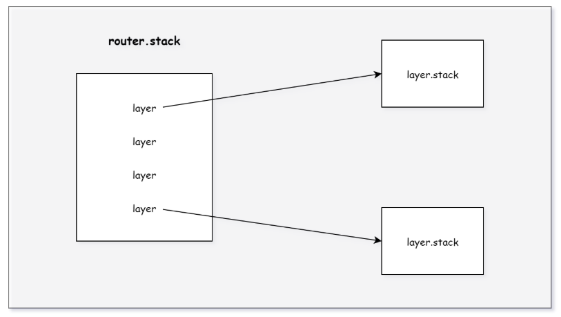

# [Koa源码学习] koa-router

## 前言

在上一章节中，我们通过调用`use`方法，给`Koa`添加中间件，来对请求进行处理，但是对于实际的应用来说，需要对各种请求，做出不同的响应。在`Koa`应用中，通常会使用`koa-router`模块，提供对路由的支持。那么接下来，我们就来看看其内部是如何实现的。

## 路由注册

在引入`koa-router`模块时，首先会执行初始化工作，在`Router`的原型对象上扩展方法，代码如下所示：

```js
/* koa-router/lib/router.js */
for (var i = 0; i < methods.length; i++) {
  function setMethodVerb(method) {
    // 在Router的原型对象上添加动词方法
    Router.prototype[method] = function(name, path, middleware) {
      // ...
    };
  }
  setMethodVerb(methods[i]);
}

// Alias for `router.delete()` because delete is a reserved word
Router.prototype.del = Router.prototype['delete'];
```

这里的`methods`表示`HTTP`的动词列表，首先遍历`methods`，然后调用`setMethodVerb`方法，在`Router`的原型上添加对应的动词方法，执行完成后，就可以使用`router.get`、`router.post`之类的方法，进行路由注册。

我们首先来看下`Router`的构造函数：

```js
/* koa-router/lib/router.js */
function Router(opts) {
  if (!(this instanceof Router)) {
    return new Router(opts);
  }

  this.opts = opts || {};
  this.methods = this.opts.methods || [
    'HEAD',
    'OPTIONS',
    'GET',
    'PUT',
    'PATCH',
    'POST',
    'DELETE'
  ];

  // 前置参数中间件
  this.params = {};
  // 路由表
  this.stack = [];
};
```

在创建`Router`的实例后，就可以向其中添加路由信息了。在添加路由中间件时，可以根据使用的方式，将其分为两种类型：

1. `verb`：直接使用请求`method`添加中间件，包括`get`、`post`、`del`、`all`(包含所有方法)等。

2. `use`：直接使用`use`方法添加中间件。

那么接下来，我们就来看看对于这两种方式，`koa-router`是如何进行处理的。

### verb

对于第一种方式，其代码如下所示：

```js
/* koa-router/lib/router.js */
Router.prototype[method] = function(name, path, middleware) {
  var middleware;

  // 支持命名路由，并且一次可以传入多个中间件
  if (typeof path === "string" || path instanceof RegExp) {
    middleware = Array.prototype.slice.call(arguments, 2);
  } else {
    middleware = Array.prototype.slice.call(arguments, 1);
    path = name;
    name = null;
  }

  // 注册路由
  this.register(path, [method], middleware, {
    name: name
  });

  return this;
};
```

可以看到，在`koa-router`中，每条路由可以支持多个中间件函数，在处理好参数后，就调用`register`方法，对路由进行注册，其代码如下所示：

```js
/* koa-router/lib/router.js */
Router.prototype.register = function (path, methods, middleware, opts) {
  opts = opts || {};

  var router = this;
  var stack = this.stack;

  // ...

  // 创建路由，这里的methods和middleware都是数组
  var route = new Layer(path, methods, middleware, {
    end: opts.end === false ? opts.end : true,
    name: opts.name,
    sensitive: opts.sensitive || this.opts.sensitive || false,
    strict: opts.strict || this.opts.strict || false,
    prefix: opts.prefix || this.opts.prefix || "",
    ignoreCaptures: opts.ignoreCaptures
  });

  // 重新设置路由的匹配规则
  if (this.opts.prefix) {
    route.setPrefix(this.opts.prefix);
  }

  // 给符合条件的路由添加前置的参数中间件
  for (var i = 0; i < Object.keys(this.params).length; i++) {
    var param = Object.keys(this.params)[i];
    route.param(param, this.params[param]);
  }

  // 将路由信息添加到路由表中
  stack.push(route);

  return route;
};
```

可以看到，在`register`方法中，首先会根据提供的参数，创建`Layer`的实例，其代码如下所示：

```js
/* koa-router/lib/layer.js */
function Layer(path, methods, middleware, opts) {
  this.opts = opts || {};
  this.name = this.opts.name || null;
  this.methods = [];
  this.paramNames = [];
  this.stack = Array.isArray(middleware) ? middleware : [middleware];

  // 如果路由支持GET请求，那么也需要支持HEAD请求
  for(var i = 0; i < methods.length; i++) {
    var l = this.methods.push(methods[i].toUpperCase());
    if (this.methods[l-1] === 'GET') {
       this.methods.unshift('HEAD');
    }
  }

  // ensure middleware is a function
  // ...

  this.path = path;
  // 根据参数，生成路由匹配规则
  this.regexp = pathToRegExp(path, this.paramNames, this.opts);
};
```

在初始化`Layer`的过程中，首先将中间件`middleware`添加到`layer.stack`中，然后将`methods`添加到`layer.methods`中，最后调用`pathToRegExp`方法，根据传入的路径和配置创建对应的正则表达式，用于检测请求的`path`是否与该路由匹配，如果`layer`中包含动态参数，还会将其添加到`layer.paramNames`中。

回到上面的`register`方法，在创建完路由后，还有两段额外的逻辑：

1. `route.setPrefix`：如果在创建`router`时配置了`prefix`选项，那么需要更新路由配置，代码如下所示：

    ```js
    /* koa-router/lib/layer.js */
    Layer.prototype.setPrefix = function (prefix) {
      if (this.path) {
        // 拼接前缀，重新设置路由的匹配规则
        this.path = prefix + this.path;
        this.paramNames = [];
        this.regexp = pathToRegExp(this.path, this.paramNames, this.opts);
      }

      return this;
    };
    ```

    可以看到，其实就是再次调用`pathToRegExp`方法，重新生成`regexp`和`paramNames`。

2. `route.param`：如果在`router`中定义了某些参数对应的前置中间件，并且该`layer`中也包含该动态参数，就会将其对应前置中间件插入到`layer`中间件之前，用来做一些预处理工作，之后会详细分析。

在`register`方法的最后，将生成的路由添加到`router.stack`中，完成`verb`路由的注册。

### use

对于通过动词方式添加的路由来说，只有当请求的`method`和`path`完全匹配时，才会将其对应的中间件加入到执行列表，但是，对于`use`来说，它不需要匹配`method`，而且`path`只需要匹配前缀即可，这可以用来提供一些通用的处理逻辑，其代码如下所示：

```js
/* koa-router/lib/router.js */
Router.prototype.use = function () {
  var router = this;
  var middleware = Array.prototype.slice.call(arguments);
  var path;

  // support array of paths
  // ...

  // 支持命名路由
  var hasPath = typeof middleware[0] === 'string';
  if (hasPath) {
    path = middleware.shift();
  }

  for (var i = 0; i < middleware.length; i++) {
    var m = middleware[i];
    if (m.router) {
      // 子路由

      // 拷贝子路由
      var cloneRouter = Object.assign(Object.create(Router.prototype), m.router, {
        stack: m.router.stack.slice(0)
      });

      for (var j = 0; j < cloneRouter.stack.length; j++) {
        // 拷贝子路由中的路由信息
        var nestedLayer = cloneRouter.stack[j];
        var cloneLayer = Object.assign(
          Object.create(Layer.prototype),
          nestedLayer
        );

        // 根据当前路由，重新设置路由的匹配规则
        if (path) cloneLayer.setPrefix(path);
        if (router.opts.prefix) cloneLayer.setPrefix(router.opts.prefix);
        // 将子路由中的路由信息，拷贝之后添加到当前路由中
        router.stack.push(cloneLayer);
        cloneRouter.stack[j] = cloneLayer;
      }

      // 给符合条件的路由添加前置的参数中间件
      if (router.params) {
        function setRouterParams(paramArr) {
          var routerParams = paramArr;
          for (var j = 0; j < routerParams.length; j++) {
            var key = routerParams[j];
            cloneRouter.param(key, router.params[key]);
          }
        }
        setRouterParams(Object.keys(router.params));
      }
    } else {
      // 注册中间件，这里没有method，并且配置选项与之前不同
      router.register(path || '(.*)', [], m, { end: false, ignoreCaptures: !hasPath });
    }
  }

  return this;
};
```

可以看到，在使用`use`方法添加中间件时，其内部有两种逻辑：

1. 对于普通的中间件函数，直接使用`register`方法，向`router`中注册路由，这里与之前相比，就是`methods`数组为空，并且传入的`options.end`为`false`，这样在调用`pathToRegExp`方法时，所生成的正则表达式就只用匹配前缀即可，不用全路径匹配。

2. 如果`m.router`存在，说明是子`Router`实例，需要将其包含的路由信息，展开后添加到当前路由器中，所以这里首先遍历子`router.stack`，将路由信息进行拷贝，如果存在`path`或`prefix`，同样会调用`setPrefix`方法，重新设置路由的匹配规则，然后将拷贝后路由信息添加到当前路由器中，最后，同样需要判断是否存在前置的参数中间件，如果存在，就将其添加到新的`layer.stack`前面。

### router.routes()

向`router`中注册路由后，还需要调用`router.routes`方法，将整个`router`以一个中间件的形式，注册到`Koa`的实例中，代码如下所示：

```js
/* koa-router/lib/router.js */
Router.prototype.routes = Router.prototype.middleware = function () {
  var router = this;

  var dispatch = function dispatch(ctx, next) {
    // ...
  };

  // 在router.use中使用的子路由
  dispatch.router = this;

  return dispatch;
};
```

可以看到，调用该方法会返回一个符合`Koa`中间件形式的`dispatch`方法，所以在收到来自客户端的请求时，就会执行这里的`dispatch`方法，然后`router`会根据其内部的路由表，找出符合请求条件的路由信息，最后对请求进行相应的处理。



## 处理请求

当应用程序执行到`router`对应的中间件时，就会调用上面的`dispatch`方法，其代码如下所示：

```js
/* koa-router/lib/router.js */
Router.prototype.routes = Router.prototype.middleware = function () {
  // ...
  var dispatch = function dispatch(ctx, next) {
    debug('%s %s', ctx.method, ctx.path);

    var path = router.opts.routerPath || ctx.routerPath || ctx.path;
    // 执行match方法，找出路由表所有与path、method相匹配的路由信息
    var matched = router.match(path, ctx.method);
    var layerChain, layer, i;

    if (ctx.matched) {
      ctx.matched.push.apply(ctx.matched, matched.path);
    } else {
      ctx.matched = matched.path;
    }

    ctx.router = router;

    // 从路由表中没有找到与请求相匹配的路由信息时，直接跳过当前router，执行下一个中间件
    if (!matched.route) return next();

    var matchedLayers = matched.pathAndMethod
    var mostSpecificLayer = matchedLayers[matchedLayers.length - 1]
    ctx._matchedRoute = mostSpecificLayer.path;
    if (mostSpecificLayer.name) {
      ctx._matchedRouteName = mostSpecificLayer.name;
    }

    // 将layer中的中间件展平
    layerChain = matchedLayers.reduce(function(memo, layer) {
      // 在各个layer前插入一个中间件，用来处理动态路由参数
      memo.push(function(ctx, next) {
        ctx.captures = layer.captures(path, ctx.captures);
        ctx.params = layer.params(path, ctx.captures, ctx.params);
        ctx.routerName = layer.name;
        return next();
      });
      return memo.concat(layer.stack);
    }, []);

    // 调用compose方法，构造执行器，这里的next用来跳出当前router，执行下一个中间件
    return compose(layerChain)(ctx, next);
  };
  // ...
};
```

可以看到，在`dispatch`方法中，首先会调用`router.match`方法，从当前`router`中找出所有与本次请求相匹配的路由信息，其代码如下所示：

```js
/* koa-router/lib/router.js */
Router.prototype.match = function (path, method) {
  var layers = this.stack;
  var layer;
  var matched = {
    // 只检测路径
    path: [],
    // 路径和请求方法都需要匹配
    pathAndMethod: [],
    // 当前router中是否存在相匹配的路由信息
    route: false
  };

  for (var len = layers.length, i = 0; i < len; i++) {
    layer = layers[i];

    debug('test %s %s', layer.path, layer.regexp);

    // 检测路径是否匹配
    if (layer.match(path)) {
      matched.path.push(layer);

      if (layer.methods.length === 0 || ~layer.methods.indexOf(method)) {
        matched.pathAndMethod.push(layer);
        if (layer.methods.length) matched.route = true;
      }
    }
  }

  return matched;
};
```

`match`方法接收当前请求的`path`和`method`，根据这两个信息，就可以从当前`router`中找出相匹配的路由信息。在该方法中，首先遍历`router.stack`，取出路由信息后，调用`layer.match`方法，其代码如下所示：

```js
/* koa-router/lib/layer.js */
Layer.prototype.match = function (path) {
  return this.regexp.test(path);
};
```

这里就是使用之前通过`pathToRegExp`生成的正则表达式，来检测请求的`path`与当前路由的`path`是否匹配，如果测试通过，说明本条路由是匹配的，就将其添加到`matched.path`中，除了判断`path`以外，我们还需要判断请求的`method`是否在当前`layer.methods`中，如果也支持，就将其添加到`matched.pathAndMethod`中，并且将`matched.route`设置为`true`。

这里除了判断`verb`类型的路由外，还有另一段逻辑，当`layer.methods.length === 0`时，表示这是通过`router.use`添加的中间件，同样也将其添加到`matched.pathAndMethod`中，但是不会修改`matched.route`，从这里可以看出，一个`router`必须至少匹配一个动词对应的路由，如果没有匹配，就会直接跳过当前`router`。

回到上面的`dispatch`方法，我们已经从`router`中找到了所有与当前请求相匹配的路由信息，如果存在匹配路由，那么就需要执行这些路由对应的中间件，在执行之前，由于可能存在动态路由，而在它对应的中间件中需要能够使用`params`获取参数，所以首先使用`reduce`方法，在每个匹配路由之前，插入一个新的中间件，用来处理参数，其代码如下所示：

```js
/* koa-router/lib/layer.js */
Layer.prototype.params = function (path, captures, existingParams) {
  var params = existingParams || {};

  for (var len = captures.length, i=0; i<len; i++) {
    if (this.paramNames[i]) {
      var c = captures[i];
      // 构建params参数，之后就可以通过ctx.params进行访问
      params[this.paramNames[i].name] = c ? safeDecodeURIComponent(c) : c;
    }
  }

  return params;
};
```

插入完成后，使用`concat`方法将`layer.stack`中的中间件展平，最终，就得到了本次请求，此`router`需要执行的所有中间件。

在得到所有待执行的中间件后，同样需要一个异步执行器，用来执行这些中间件，所以这里也使用了`compose`方法，首先对中间件进行组合，然后立即调用，与之前在`koa`中相比，这里除了传入`ctx`外，还多传入了一个`next`方法，只有在最后一个中间件中继续调用`next`时，才会执行该方法，用来将执行权从`router`中移交给下一个中间件处理程序。

## 前置的参数中间件

在前面进行路由注册的时候，有一段插入参数中间件的逻辑，首先会检查`router.params`，其代码如下所示：

```js
/* koa-router/lib/router.js */
Router.prototype.register = function (path, methods, middleware, opts) {
  // ...

  // add parameter middleware
  for (var i = 0; i < Object.keys(this.params).length; i++) {
    var param = Object.keys(this.params)[i];
    route.param(param, this.params[param]);
  }

  // ...
};
```

而这里的`router.params`，是通过`router.param`方法注册的：

```js
/* koa-router/lib/router.js */
Router.prototype.param = function(param, middleware) {
  this.params[param] = middleware;
  for (var i = 0; i < this.stack.length; i++) {
    var route = this.stack[i];
    route.param(param, middleware);
  }

  return this;
};
```

从上面的两段逻辑可以看出，`router.params`中存储着参数名和与之对应的中间件，在每次添加新的路由信息、或添加新的参数中间件时，都会调用`layer.param`方法，对`layer.stack`进行修饰，其代码如下所示：

```js
/* koa-router/lib/layer.js */
Layer.prototype.param = function (param, fn) {
  // 当前layer中的中间件数组
  var stack = this.stack;
  // 通过path解析出的动态路径参数
  var params = this.paramNames;
  var middleware = function (ctx, next) {
    // 这里的第一个参数表示参数实际的值
    return fn.call(this, ctx.params[param], ctx, next);
  };
  middleware.param = param;

  // 当前layer包含的所有动态参数
  var names = params.map(function (p) {
    return p.name;
  });

  // 如果当前layer使用到了该参数，就将middleware插入到layer.stack的前面
  var x = names.indexOf(param);
  if (x > -1) {
    // iterate through the stack, to figure out where to place the handler fn
    stack.some(function (fn, i) {
      // param handlers are always first, so when we find an fn w/o a param property, stop here
      // if the param handler at this part of the stack comes after the one we are adding, stop here
      if (!fn.param || names.indexOf(fn.param) > x) {
        // inject this param handler right before the current item
        stack.splice(i, 0, middleware);
        return true; // then break the loop
      }
    });
  }

  return this;
};
```

可以看到，`router.param`提供了一种机制，可以在所有使用到该参数的路由中，将其对应的参数中间件添加到`layer.stack`前面，这样就可以在执行路由中间件前，对参数进行预处理工作。

## 总结

`koa-router`为`koa`提供了路由功能，通常情况下，业务逻辑都是按照模块编写在`router`中的，编写完成后，`router`会通过`routes`方法，将其包装成一个符合`koa`中间件形式的函数，这样在`koa`中就可以像普通中间件一样使用`router`了。
