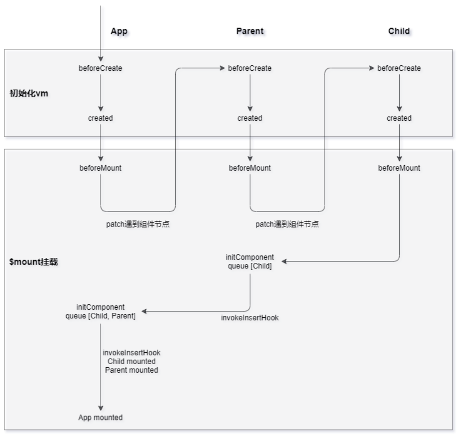

# [Vue源码学习] $mount挂载

## 前言

在前面的章节中，我们已经创建了一个`Vue`的实例，那么接下来，就可以通过`$mount`方法，将该实例挂载到页面中。

那么接下来，我们就来看看对于运行时版本来说，`$mount`是如何进行挂载的。

## $mount

对于`Web`平台来说，`$mount`方法是在引入`Vue`时添加到`Vue.prototype`上的，代码如下所示：

```js
/* platforms/web/runtime/index.js */
Vue.prototype.$mount = function (
  el?: string | Element,
  hydrating?: boolean
): Component {
  el = el && inBrowser ? query(el) : undefined
  return mountComponent(this, el, hydrating)
}
```

可以看到，在`$mount`方法中，首先通过`query`方法找到`el`选项对应的`DOM`元素，然后调用`mountComponent`方法：

```js
/* core/instance/lifecycle.js */
export function mountComponent(
  vm: Component,
  el: ?Element,
  hydrating?: boolean
): Component {
  vm.$el = el
  // ...
  callHook(vm, 'beforeMount')

  let updateComponent

  // 依赖收集 + 派发更新
  updateComponent = () => {
    vm._update(vm._render(), hydrating)
  }

  // 渲染Watcher
  // we set this to vm._watcher inside the watcher's constructor
  // since the watcher's initial patch may call $forceUpdate (e.g. inside child
  // component's mounted hook), which relies on vm._watcher being already defined
  new Watcher(vm, updateComponent, noop, {
    before() {
      if (vm._isMounted && !vm._isDestroyed) {
        callHook(vm, 'beforeUpdate')
      }
    }
  }, true /* isRenderWatcher */)
  hydrating = false

  // 根组件挂载完毕
  // manually mounted instance, call mounted on self
  // mounted is called for render-created child components in its inserted hook
  if (vm.$vnode == null) {
    vm._isMounted = true
    callHook(vm, 'mounted')
  }
  return vm
}
```

可以看到，`mountComponent`方法的逻辑很简单，主要就是创建一个渲染`Watcher`，对于每个`Vue`实例来说，有且仅有一个渲染`Watcher`与之对应，通过此渲染`Watcher`，`Vue`就可以完成依赖收集和派发更新的整个过程，而这里的关键方法就是`updateComponent`，它里面的`_render`方法就是用来创建`VNode`并收集依赖，`_update`方法就是将`VNode`渲染成真实的`DOM`，里面的具体细节之后会详细介绍，在`mountComponent`方法的最后，对于根组件来说，它会调用`mounted`钩子函数，通知应用已经完成挂载。

那么接下来，我们就来看看在在创建渲染`Watcher`的过程中，`Vue`内部又做了哪些工作。

## 渲染Watcher

`Watcher`的代码如下所示：

```js
/* core/observer/watcher.js */
export default class Watcher {
  constructor(
    vm: Component,
    expOrFn: string | Function,
    cb: Function,
    options?: ?Object,
    isRenderWatcher?: boolean
  ) {
    this.vm = vm
    // 渲染Watcher
    if (isRenderWatcher) {
      vm._watcher = this
    }
    vm._watchers.push(this)
    // options
    if (options) {
      this.deep = !!options.deep
      this.user = !!options.user
      this.lazy = !!options.lazy
      this.sync = !!options.sync
      this.before = options.before
    } else {
      this.deep = this.user = this.lazy = this.sync = false
    }
    this.cb = cb
    this.id = ++uid // uid for batching
    this.active = true
    this.dirty = this.lazy // for lazy watchers
    this.deps = []
    this.newDeps = []
    this.depIds = new Set()
    this.newDepIds = new Set()
    this.expression = process.env.NODE_ENV !== 'production'
      ? expOrFn.toString()
      : ''
    // parse expression for getter
    if (typeof expOrFn === 'function') {
      this.getter = expOrFn
    } else {
      // ...
    }
    // 在创建渲染Watcher时，会直接调用get方法
    this.value = this.lazy
      ? undefined
      : this.get()
  }

  get() {
    // 将Dep.target设置为当前正在处理的Watcher实例
    pushTarget(this)
    let value
    const vm = this.vm
    try {
      value = this.getter.call(vm, vm)
    } catch (e) {
      if (this.user) {
        handleError(e, vm, `getter for watcher "${this.expression}"`)
      } else {
        throw e
      }
    } finally {
      // "touch" every property so they are all tracked as
      // dependencies for deep watching
      if (this.deep) {
        traverse(value)
      }
      popTarget()
      // 清理多余的依赖
      this.cleanupDeps()
    }
    return value
  }
}
```

可以看到，在创建渲染`Watcher`的过程中，首先会将刚刚的`updateComponent`方法赋值给`Watcher`实例的`getter`，然后直接调用`watcher.get`方法，在此方法中，会先后调用两个关键的方法`pushTarget`和`popTarget`，我们先来看看这两个方法的实现：

```js
/* core/observer/dep.js */
Dep.target = null
const targetStack = []

export function pushTarget(target: ?Watcher) {
  targetStack.push(target)
  Dep.target = target
}

export function popTarget() {
  targetStack.pop()
  Dep.target = targetStack[targetStack.length - 1]
}
```

可以看到，这里的`targetStack`就是模拟了一个栈结构，用来存储各种`watcher`的实例，调用`pushTarget`会先将当前`watcher`入栈，然后将其赋值给`Dep.target`，调用`popTarget`会先将最顶层的`watcher`出栈，然后将`Dep.target`指向下一个`watcher`，所以在这两个方法中间，就可以在任意位置通过`Dep.target`找到当前正在处理的`watcher`实例。

回到上面的`get`方法中，首先会调用`pushTarget`，将`Dep.target`指向当前的渲染`watcher`，然后就会调用`watcher.getter`方法，也就是上面传入的`updateComponent`方法，在该方法中，`Vue`首先会调用`_render`方法生成`VNode`，然后调用`_update`方法根据`VNode`渲染成真实的`DOM`，在调用完`updateComponent`方法后，就会调用`popTarget`方法，恢复`Dep.target`的指向，最后调用`cleanupDeps`方法，对多余的依赖进行清理。

此时，初始化渲染`Watcher`的工作也已经完成了，并且在`_render`的过程中，渲染`Watcher`也已经收集到了所有它需要依赖的数据，所以当这些数据发生变化时，就会通知渲染`Watcher`做更新操作，这部分内容会在之后的章节中详细介绍。

## 初始化的整体流程

从这几章节中，我们知道了根组件的初始化和挂载逻辑，而对于子组件来说也是类似的，它也会在父组件执行挂载的过程中进行初始化和挂载，具体的执行流程如下图所示：



## 总结

在`Vue`中，组件的初始化和挂载是两个独立的模块，在调用`$mount`进行挂载的过程中，`Vue`会创建一个渲染`Watcher`，然后立即调用一次`watcher.get`，进而完成依赖收集和首次挂载的逻辑，当`Watcher`所依赖的数据发生变化时，又会通知此`Watcher`做更新操作，从而重新收集依赖和派发更新。
