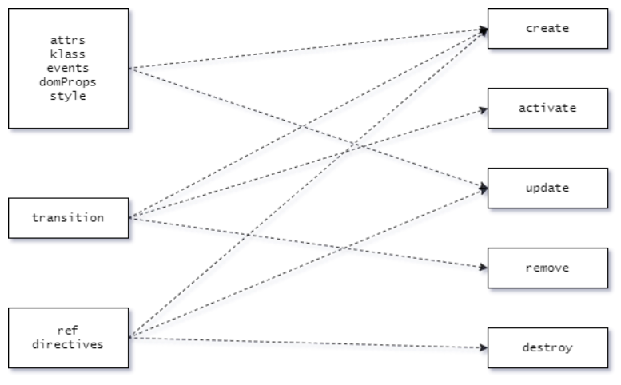

# [Vue源码学习] _update（上）

## 前言

在上一章节中，通过调用`_render`方法，最终生成了一个`VNode`节点，那么接下来，就会调用`_update`方法，`Vue`会根据这个`VNode`渲染成真实的`DOM`。

## _update

`_update`的代码如下所示：

```js
/* core/instance/lifecycle.js */
Vue.prototype._update = function (vnode: VNode, hydrating?: boolean) {
  const vm: Component = this
  const prevEl = vm.$el
  const prevVnode = vm._vnode
  const restoreActiveInstance = setActiveInstance(vm)
  vm._vnode = vnode
  // Vue.prototype.__patch__ is injected in entry points
  // based on the rendering backend used.
  if (!prevVnode) {
    // initial render
    vm.$el = vm.__patch__(vm.$el, vnode, hydrating, false /* removeOnly */)
  } else {
    // updates
    vm.$el = vm.__patch__(prevVnode, vnode)
  }
  restoreActiveInstance()
  // update __vue__ reference
  if (prevEl) {
    prevEl.__vue__ = null
  }
  if (vm.$el) {
    vm.$el.__vue__ = vm
  }
  // if parent is an HOC, update its $el as well
  if (vm.$vnode && vm.$parent && vm.$vnode === vm.$parent._vnode) {
    vm.$parent.$el = vm.$el
  }
  // updated hook is called by the scheduler to ensure that children are
  // updated in a parent's updated hook.
}
```

可以看到，在`_update`方法中，`Vue`会根据是否是初次渲染，使用不同的参数调用`__patch__`方法，那么接下来，我们就来详细看看其内部是如何实现的。

## patch

在看`patch`的实现之前，需要了解`patch`方法是如何构建出来的，因为对于`VNode`来说，它只是一个节点的描述符，而不同的平台需要使用各自原生的方法对`VNode`进行渲染，而对于`Web`平台来说，`patch`方法是在引入`Vue`时添加到原型上的，代码如下所示：

```js
/* platforms/web/runtime/patch.js */
export const patch: Function = createPatchFunction({ nodeOps, modules })

/* platforms/web/runtime/index.js */
Vue.prototype.__patch__ = inBrowser ? patch : noop
```

可以看到，`patch`又是通过调用`createPatchFunction`方法构建的，而这里的`nodeOps`和`modules`，都是与当前平台相关的代码，所以不同的平台只需要使用与之对应的`nodeOps`和`modules`，就可以使用同一个`createPatchFunction`方法构建出适合当前平台的`patch`方法。`createPatchFunction`的源码在`core/vdom/patch.js`中，最终返回的`patch`方法如下所示：

```js
/* core/vdom/patch.js */
function patch(oldVnode, vnode, hydrating, removeOnly) {
  if (isUndef(vnode)) {
    if (isDef(oldVnode)) invokeDestroyHook(oldVnode)
    return
  }

  let isInitialPatch = false
  const insertedVnodeQueue = []

  if (isUndef(oldVnode)) {
    // empty mount (likely as component), create new root element
    isInitialPatch = true
    createElm(vnode, insertedVnodeQueue)
  } else {
    const isRealElement = isDef(oldVnode.nodeType)
    if (!isRealElement && sameVnode(oldVnode, vnode)) {
      // patch existing root node
      patchVnode(oldVnode, vnode, insertedVnodeQueue, null, null, removeOnly)
    } else {
      if (isRealElement) {
        // ...
        // either not server-rendered, or hydration failed.
        // create an empty node and replace it
        oldVnode = emptyNodeAt(oldVnode)
      }

      // replacing existing element
      const oldElm = oldVnode.elm
      const parentElm = nodeOps.parentNode(oldElm)

      // create new node
      createElm(
        vnode,
        insertedVnodeQueue,
        // extremely rare edge case: do not insert if old element is in a
        // leaving transition. Only happens when combining transition +
        // keep-alive + HOCs. (#4590)
        oldElm._leaveCb ? null : parentElm,
        nodeOps.nextSibling(oldElm)
      )

      // update parent placeholder node element, recursively
      if (isDef(vnode.parent)) {
        let ancestor = vnode.parent
        const patchable = isPatchable(vnode)
        while (ancestor) {
          for (let i = 0; i < cbs.destroy.length; ++i) {
            cbs.destroy[i](ancestor)
          }
          ancestor.elm = vnode.elm
          if (patchable) {
            for (let i = 0; i < cbs.create.length; ++i) {
              cbs.create[i](emptyNode, ancestor)
            }
            // #6513
            // invoke insert hooks that may have been merged by create hooks.
            // e.g. for directives that uses the "inserted" hook.
            const insert = ancestor.data.hook.insert
            if (insert.merged) {
              // start at index 1 to avoid re-invoking component mounted hook
              for (let i = 1; i < insert.fns.length; i++) {
                insert.fns[i]()
              }
            }
          } else {
            registerRef(ancestor)
          }
          ancestor = ancestor.parent
        }
      }

      // destroy old node
      if (isDef(parentElm)) {
        removeVnodes([oldVnode], 0, 0)
      } else if (isDef(oldVnode.tag)) {
        invokeDestroyHook(oldVnode)
      }
    }
  }

  invokeInsertHook(vnode, insertedVnodeQueue, isInitialPatch)
  return vnode.elm
}
```

可以看到，`patch`方法还是比较复杂的，因为里面包含了创建、更新、删除等逻辑，我们可以将其分为以下四种情况：

1. 卸载组件：如果`vnode`不存在，说明当前组件没有需要渲染的内容，同时，如果`oldVnode`存在，就调用`invokeDestroyHook`方法，执行`oldVnode`的卸载逻辑：

    ```js
    if (isUndef(vnode)) {
      if (isDef(oldVnode)) invokeDestroyHook(oldVnode)
      return
    }
    ```

    ```js
    function invokeDestroyHook(vnode) {
      let i, j
      const data = vnode.data
      if (isDef(data)) {
        if (isDef(i = data.hook) && isDef(i = i.destroy)) i(vnode)
        for (i = 0; i < cbs.destroy.length; ++i) cbs.destroy[i](vnode)
      }
      if (isDef(i = vnode.children)) {
        for (j = 0; j < vnode.children.length; ++j) {
          invokeDestroyHook(vnode.children[j])
        }
      }
    }
    ```

2. 组件的首次渲染：如果`oldVnode`不存在，说明是组件的首次渲染，首先将标志位`isInitialPatch`设置为`true`，然后调用`createElm`方法，根据`vnode`生成真实的`DOM`，最后还会调用`invokeInsertHook`方法，将其内部包含的子组件添加到父占位符节点的`data.pendingInsert`中：

    ```js
    let isInitialPatch = false
    const insertedVnodeQueue = []

    if (isUndef(oldVnode)) {
      // empty mount (likely as component), create new root element
      isInitialPatch = true
      createElm(vnode, insertedVnodeQueue)
    }

    invokeInsertHook(vnode, insertedVnodeQueue, isInitialPatch)
    ```

    ```js
    function invokeInsertHook(vnode, queue, initial) {
      // delay insert hooks for component root nodes, invoke them after the
      // element is really inserted
      if (isTrue(initial) && isDef(vnode.parent)) {
        vnode.parent.data.pendingInsert = queue
      } else {
        // ...
      }
    }
    ```

    当回到组件的父占位符节点时，又会调用`initComponent`方法，将`pendingInsert`中的节点提取到`insertedVnodeQueue`中：

    ```js
    function initComponent(vnode, insertedVnodeQueue) {
      if (isDef(vnode.data.pendingInsert)) {
        insertedVnodeQueue.push.apply(insertedVnodeQueue, vnode.data.pendingInsert)
        vnode.data.pendingInsert = null
      }
      // ...
    }
    ```

3. 组件的对比更新：如果新旧节点都存在，并且通过`sameVnode`检测到它们是相同的节点，那么就不需要重新创建一个全新的`DOM`了，而是复用此`DOM`，然后通过对比`vnode`和`oldVnode`中的`data`和`children`，做更新操作：

    ```js
    const isRealElement = isDef(oldVnode.nodeType)
    if (!isRealElement && sameVnode(oldVnode, vnode)) {
      // patch existing root node
      patchVnode(oldVnode, vnode, insertedVnodeQueue, null, null, removeOnly)
    }
    ```

    ```js
    function sameVnode(a, b) {
      return (
        a.key === b.key && (
          (
            a.tag === b.tag &&
            a.isComment === b.isComment &&
            isDef(a.data) === isDef(b.data) &&
            sameInputType(a, b)
          ) || (
            isTrue(a.isAsyncPlaceholder) &&
            a.asyncFactory === b.asyncFactory &&
            isUndef(b.asyncFactory.error)
          )
        )
      )
    }
    ```

4. 创建新节点并移除旧节点：如果以上的情况都不满足，说明需要根据`vnode`重新创建新的节点，然后根据`oldVnode`删除旧的节点，从而达到页面更新的逻辑。

从上面的代码中可以看出，`patch`中最关键的两个方法是`createElm`和`patchVnode`，这两个方法会在之后的两小节中详细介绍。在这之前，我们先来看看在执行`patch`的过程中，都运行了哪些`hook`。

## hooks

在`patch`的过程中，其实包含了两种类型的`hook`，一种是与`VNode`相关的`hook`，一种是`modules`相关的`hook`。

`VNode`相关的`hook`很好理解，在之前创建组件`VNode`时就已经见过了，这种类型的`hook`都是与`VNode`的操作相关的。

`modules`相关的`hook`主要是用来处理`vnode.data`中的数据，它会在创建`patch`方法时，进行预处理操作：

```js
/* platforms/web/runtime/patch.js */
const hooks = ['create', 'activate', 'update', 'remove', 'destroy']

export function createPatchFunction(backend) {
  let i, j
  const cbs = {}

  const { modules, nodeOps } = backend

  for (i = 0; i < hooks.length; ++i) {
    cbs[hooks[i]] = []
    for (j = 0; j < modules.length; ++j) {
      if (isDef(modules[j][hooks[i]])) {
        cbs[hooks[i]].push(modules[j][hooks[i]])
      }
    }
  }
}
```

由于这里`modules`代表的是平台相关的模块，所以对于`Web`平台来说中，`Vue`支持对以下8种模块的处理，如下所示：



可以看到，这里的模块都可以从`VNodeData`中找到映射，而且这些`modules`钩子函数也是伴随`VNode hook`进行处理的。

## 总结

在`patch`方法中，`Vue`会根据新旧`vnode`的状态，执行不同的操作，同时在创建、更新、删除节点的时候，执行相应的`VNode`钩子函数，同时也会根据`modules`钩子函数处理`vnode.data`中的数据，将其作用与`DOM`上。
