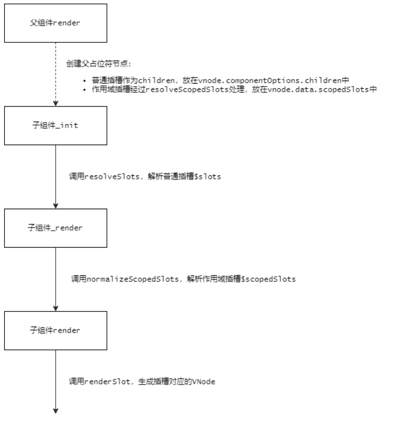

# [Vue源码学习] 插槽（下）

## 前言

在上一章节中，经过编译阶段的处理，已经将模板生成了对应的渲染函数，那么接下来，就来看看在运行时中，`Vue`是如何处理插槽的。

## 运行时

在初始渲染的时候，程序会先执行父组件的`_render`，用来生成`VNode`，而根据上一节中生成的渲染函数：

```js
function anonymous() {
  with (this) {
    return _c('div', {
      staticClass: "parent"
    }, [_c('child', {
      scopedSlots: _u([{
        key: "header",
        fn: function () {
          return [_c('div', [_v("Parent Heaader")])]
        },
        proxy: true
      }, {
        key: "default",
        fn: function (slotProps) {
          return [_c('div', [_v("Parent " + _s(slotProps.message))])]
        }
      }, {
        key: "footer",
        fn: function () {
          return [_c('div', [_v("Parent Footer")])]
        },
        proxy: true
      }])
    })], 1)
  }
}
```

可以看到，在构造`child`父占位符节点时，会调用`_u`方法，对插槽进行处理：

```js
/* core/instance/render-helpers/index.js */
export function installRenderHelpers(target: any) {
  // ...
  target._u = resolveScopedSlots
  // ...
}

/* core/instance/render-helpers/resolve-scoped-slots.js */
export function resolveScopedSlots(
  fns: ScopedSlotsData, // see flow/vnode
  res?: Object,
  // the following are added in 2.6
  hasDynamicKeys?: boolean,
  contentHashKey?: number
): { [key: string]: Function, $stable: boolean } {
  res = res || { $stable: !hasDynamicKeys }
  for (let i = 0; i < fns.length; i++) {
    const slot = fns[i]
    if (Array.isArray(slot)) {
      resolveScopedSlots(slot, res, hasDynamicKeys)
    } else if (slot) {
      // marker for reverse proxying v-slot without scope on this.$slots
      if (slot.proxy) {
        slot.fn.proxy = true
      }
      res[slot.key] = slot.fn
    }
  }
  if (contentHashKey) {
    (res: any).$key = contentHashKey
  }
  return res
}
```

可以看到，`resolveScopedSlots`方法只是简单的将作用域插槽从数组的形式转换成对象的形式，同时，在整个创建父占位符节点的过程中，都没有去执行对应的插槽函数，创建完父占位符节点后，就可以通过`vnode.data.scopedSlots`访问到这些插槽函数了。

在父组件执行`patch`的过程中，当解析到父占位符节点时，会去创建子组件的实例，在调用`initRender`方法时，会在子组件的实例上添加`$slots`和`$scopedSlots`属性，代码如下所示：

```js
/* core/instance/render.js */
export function initRender(vm: Component) {
  // ...
  const parentVnode = vm.$vnode = options._parentVnode // the placeholder node in parent tree
  const renderContext = parentVnode && parentVnode.context
  vm.$slots = resolveSlots(options._renderChildren, renderContext)
  vm.$scopedSlots = emptyObject
  // ...
}

export function resolveSlots(
  children: ?Array<VNode>,
  context: ?Component
): { [key: string]: Array<VNode> } {
  if (!children || !children.length) {
    return {}
  }
  const slots = {}
  for (let i = 0, l = children.length; i < l; i++) {
    const child = children[i]
    const data = child.data
    // remove slot attribute if the node is resolved as a Vue slot node
    if (data && data.attrs && data.attrs.slot) {
      delete data.attrs.slot
    }
    // named slots should only be respected if the vnode was rendered in the
    // same context.
    if ((child.context === context || child.fnContext === context) &&
      data && data.slot != null
    ) {
      const name = data.slot
      const slot = (slots[name] || (slots[name] = []))
      if (child.tag === 'template') {
        slot.push.apply(slot, child.children || [])
      } else {
        slot.push(child)
      }
    } else {
      (slots.default || (slots.default = [])).push(child)
    }
  }
  // ignore slots that contains only whitespace
  for (const name in slots) {
    if (slots[name].every(isWhitespace)) {
      delete slots[name]
    }
  }
  return slots
}
```

可以看到，`resolveSlots`方法主要是用来处理组件的`children`，在新版本中，只有不使用`v-slot`指令时，`children`才有值，否则，所有的插槽都放在了`data.scopedSlots`中，此时的`options._renderChildren`为空。然后在子组件挂载的过程中，会执行子组件的渲染过程，首先会调用`_render`方法，代码如下所示：

```js
/* core/instance/render.js */
Vue.prototype._render = function (): VNode {
  const vm: Component = this
  const { render, _parentVnode } = vm.$options

  if (_parentVnode) {
    vm.$scopedSlots = normalizeScopedSlots(
      _parentVnode.data.scopedSlots,
      vm.$slots,
      vm.$scopedSlots
    )
  }
  // ...
}
```

可以看到，对于子组件来说，这里的`_parentVnode`代表着父占位符节点，所以在调用渲染函数之前，会调用`normalizeScopedSlots`方法，解析插槽的内容，代码如下所示：

```js
/* core/vdom/helpers/normalize-scoped-slots.js */
export function normalizeScopedSlots(
  slots: { [key: string]: Function } | void,
  normalSlots: { [key: string]: Array<VNode> },
  prevSlots?: { [key: string]: Function } | void
): any {
  let res
  const hasNormalSlots = Object.keys(normalSlots).length > 0
  const isStable = slots ? !!slots.$stable : !hasNormalSlots
  const key = slots && slots.$key
  if (!slots) {
    res = {}
  } else if (slots._normalized) {
    // fast path 1: child component re-render only, parent did not change
    return slots._normalized
  } else if (
    isStable &&
    prevSlots &&
    prevSlots !== emptyObject &&
    key === prevSlots.$key &&
    !hasNormalSlots &&
    !prevSlots.$hasNormal
  ) {
    // fast path 2: stable scoped slots w/ no normal slots to proxy,
    // only need to normalize once
    return prevSlots
  } else {
    res = {}
    for (const key in slots) {
      if (slots[key] && key[0] !== '$') {
        res[key] = normalizeScopedSlot(normalSlots, key, slots[key])
      }
    }
  }
  // expose normal slots on scopedSlots
  for (const key in normalSlots) {
    if (!(key in res)) {
      res[key] = proxyNormalSlot(normalSlots, key)
    }
  }
  // avoriaz seems to mock a non-extensible $scopedSlots object
  // and when that is passed down this would cause an error
  if (slots && Object.isExtensible(slots)) {
    (slots: any)._normalized = res
  }
  def(res, '$stable', isStable)
  def(res, '$key', key)
  def(res, '$hasNormal', hasNormalSlots)
  return res
}

function normalizeScopedSlot(normalSlots, key, fn) {
  const normalized = function () {
    let res = arguments.length ? fn.apply(null, arguments) : fn({})
    res = res && typeof res === 'object' && !Array.isArray(res)
      ? [res] // single vnode
      : normalizeChildren(res)
    return res && (
      res.length === 0 ||
      (res.length === 1 && res[0].isComment) // #9658
    ) ? undefined
      : res
  }
  // this is a slot using the new v-slot syntax without scope. although it is
  // compiled as a scoped slot, render fn users would expect it to be present
  // on this.$slots because the usage is semantically a normal slot.
  if (fn.proxy) {
    Object.defineProperty(normalSlots, key, {
      get: normalized,
      enumerable: true,
      configurable: true
    })
  }
  return normalized
}

function proxyNormalSlot(slots, key) {
  return () => slots[key]
}
```

可以看到，`normalizeScopedSlots`方法主要是用来从父占位符节点的`data.scopedSlots`中提取对应的插槽函数，同时，当遇到需要`proxy`的作用域插槽，通过在`vm.$slots`上定义访问器属性，从而达到兼容以前普通插槽的功能，额外的，还将`this.$slots`上多余的插槽添加到`this.$scopedSlots`中，所以以后可以直接使用`this.$scopedSlots`，它包含了所有的插槽内容，最终将处理好的数据赋值给`vm.$scopedSlots`。

接下来，就会执行子组件的渲染函数，通过上一章的分析，最终的渲染函数如下所示：

```js
function anonymous() {
  with (this) {
    return _c('div', {
      staticClass: "child"
    }, [
      _t("header", [_c('div', [_v("Header")])]),
      _v(" "),
      _t("default", [_c('div', [_v("Main")])], {
        "message": message
      }),
      _v(" "),
      _t("footer", [_c('div', [_v("Footer")])])
    ], 2)
  }
}
```

可以看到，在子组件中会使用`_t`函数来处理插槽的内容，代码如下所示：

```js
/* core/instance/render-helpers/index.js */
export function installRenderHelpers(target: any) {
  // ...
  target._t = renderSlot
  // ...
}

export function renderSlot(
  name: string,
  fallback: ?Array<VNode>,
  props: ?Object,
  bindObject: ?Object
): ?Array<VNode> {
  const scopedSlotFn = this.$scopedSlots[name]
  let nodes
  if (scopedSlotFn) { // scoped slot
    props = props || {}
    if (bindObject) {
      if (process.env.NODE_ENV !== 'production' && !isObject(bindObject)) {
        warn(
          'slot v-bind without argument expects an Object',
          this
        )
      }
      props = extend(extend({}, bindObject), props)
    }
    nodes = scopedSlotFn(props) || fallback
  } else {
    nodes = this.$slots[name] || fallback
  }

  const target = props && props.slot
  if (target) {
    return this.$createElement('template', { slot: target }, nodes)
  } else {
    return nodes
  }
}
```

可以看到，`renderSlot`方法的参数是在编译的时候就确定的，`name`表示插槽的名称，`fallback`表示插槽的后备内容，`props`和`bindObject`表示插槽`props`，在该方法中，首先从`$scopedSlots`中取出对应的插槽函数`scopedSlotFn`，然后传入相应的数据，从而生成插槽对应的`VNode`，如果没有取到数据，就使用插槽的后备内容，作为回退，最后，将生成的`VNode`返回。在这里需要注意的是，在子组件内部构造的插槽数据，是作为第一个参数传递给插槽函数的，但`scopedSlotFn`的执行环境是在父组件中，所以作用域插槽既可以访问子组件传入的数据，又可以访问父实例中的数据，而且可以做到延迟创建`VNode`。

## prepatch

在组件占位符节点做更新操作时，会执行`prepatch`钩子函数，代码如下所示：

```js
/* core\vdom\create-component.js */
prepatch(oldVnode: MountedComponentVNode, vnode: MountedComponentVNode) {
  const options = vnode.componentOptions
  const child = vnode.componentInstance = oldVnode.componentInstance
  updateChildComponent(
    child,
    options.propsData, // updated props
    options.listeners, // updated listeners
    vnode, // new parent vnode
    options.children // new children
  )
}
```

```js
/* core/instance/lifecycle.js */
export function updateChildComponent(
  vm: Component,
  propsData: ?Object,
  listeners: ?Object,
  parentVnode: MountedComponentVNode,
  renderChildren: ?Array<VNode>
) {
  // determine whether component has slot children
  // we need to do this before overwriting $options._renderChildren.

  // check if there are dynamic scopedSlots (hand-written or compiled but with
  // dynamic slot names). Static scoped slots compiled from template has the
  // "$stable" marker.
  const newScopedSlots = parentVnode.data.scopedSlots
  const oldScopedSlots = vm.$scopedSlots
  const hasDynamicScopedSlot = !!(
    (newScopedSlots && !newScopedSlots.$stable) ||
    (oldScopedSlots !== emptyObject && !oldScopedSlots.$stable) ||
    (newScopedSlots && vm.$scopedSlots.$key !== newScopedSlots.$key)
  )

  // Any static slot children from the parent may have changed during parent's
  // update. Dynamic scoped slots may also have changed. In such cases, a forced
  // update is necessary to ensure correctness.
  const needsForceUpdate = !!(
    renderChildren ||               // has new static slots
    vm.$options._renderChildren ||  // has old static slots
    hasDynamicScopedSlot
  )

  // ...

  // resolve slots + force update if has children
  if (needsForceUpdate) {
    vm.$slots = resolveSlots(renderChildren, parentVnode.context)
    vm.$forceUpdate()
  }
}
```

可以看到，在`updateChildComponent`方法中，除了更新`propsData`、`listeners`外，还需要根据`children`做更新操作，不过在判断是否需要`$forceUpdate`时，这里只根据普通插槽和动态插槽来做判断，没有包含作用域插槽，这是因为作用域插槽是在子组件内部渲染的，如果作用域插槽内部使用了父组件中的数据，那么根据响应式系统，该数据的`dep`会将子组件的渲染`Watcher`加入到它的观察者列表中，所以当该数据发生改变时，第一时间就已经将子组件添加到更新列表了，所以在`updateChildComponent`方法中就不需要判断作用域插槽的逻辑了，同时，如果该数据没有发生改变，那么子组件也不需要重新渲染插槽中的内容，调用`$forceUpdate`也是浪费的。



## 总结

在编译的过程中，作用域插槽是以函数的形式创建的，所以在父组件执行渲染的过程中是不会立即创建其对应的`VNode`，而在子组件执行渲染的过程中，首先会通过`resolveSlots`和`normalizeScopedSlots`方法，构建`$slots`和`$scopedSlots`，然后在渲染函数中，使用`renderSlot`方法，传入插槽`slotProps`，去执行插槽函数，从而生成插槽对应的`VNode`。
